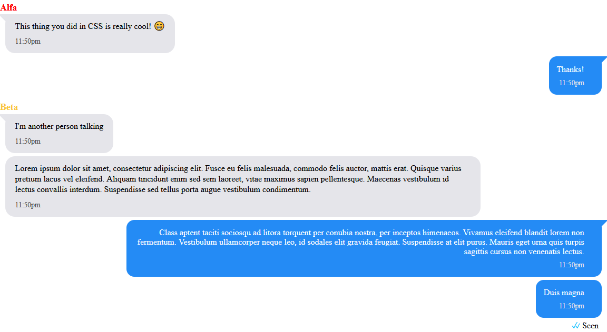

# chat-style-ao3-friendly
 An easy to use chat Work Skin for AO3

 (Please credit me in your notes.)
 


## Setup

1. Copy [the CSS file](main_chat_style.css) to a text file in your computer You can also download it and open it with a text editor. **(CAUTION: Word or GDocs is not recommended. Use Notepad or [Notepad++](https://notepad-plus-plus.org/downloads/v8.1.6/))**
2. Set the characters you want to use for the fic. On line 82, you can set the characters you want to use. You will see something like this.
   ```css
   .name.character1{
   color: #cb11f9;
   ```
   Change, or add characters, by coping that block of code, changing "character1" with your character's name with a text editor. Then, you can give it a colour. After "colour:" you will see a [hex code](https://www.w3schools.com/html/html_colors_hex.asp). Replace it with the desired hex code.

3. After adding your characters, go to your ao3 profile (while logged in), and click on "Skins". Select "Work skins" and then "Create Work Skin"

   
   
   
   
4. Fill in the details, and on the text field titled "CSS", copy and paste the CSS file with your modifications. Make sure to copy **all of it**.
5. Enter the editing screen of the work you wish to use the skin on. After the language, you will see "Select Work Skin". Select the Work Skin you have created.
## Use
In the "Chapter Text" while editting your work, select HTML. In [the example for writters, (or for those not familiar with CSS)](HTML_examples\example_for_writters.html), you will have an example on the HTML code, with "comments". These comments do not affect the code, and are simply there to help you understand it. They will start with "`<!--`" an end with "`-->`".

**If you are familiar with CSS**, [the example for HTML and CSS users](HTML_examples\example_for_HTML_CSS_users.html) has comments more suited for people with your knowledge.

## Possible upgrades:
- Support for picture messages.
- Small wiki with further explanations.
